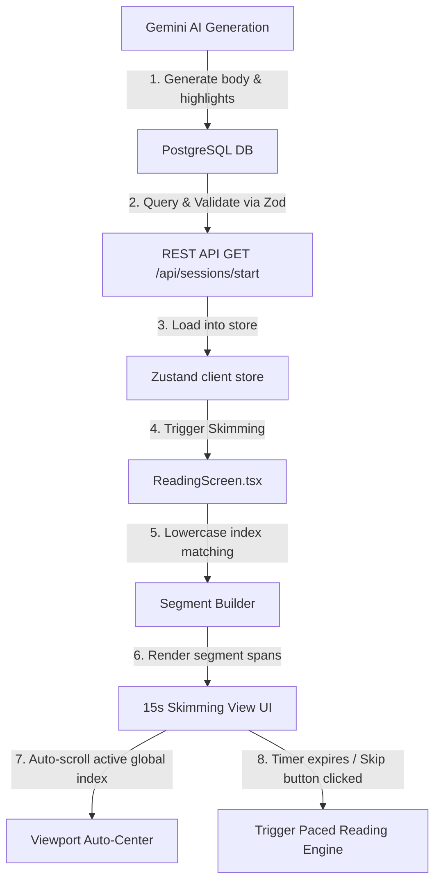

# Cognitive Priming: Structural Skimming System

The **Cognitive Priming & Structural Skimming System** in ReadShift is a scientifically-backed speed reading warm-up module. Before engaging in paced reading, users perform a 15-second selection skim. The system highlights key structural transitions, thesis statements, and vocabulary shifts sequentially across 5 distinct phases. This builds an initial cognitive roadmap of the text, significantly improving retention and pacing transfer.

---

## 1. Architectural Workflow



---

## 2. Component Pipeline

### A. Backend Generation & Database Schema
During passage creation (either via background warming jobs or on-the-fly generation), `server/src/services/aiService.ts` commands Gemini `gemini-3.1-flash-lite` to produce a structured JSON object containing:
- `body`: The passage body (460–580 words).
- `skim_highlights`: An array of exactly 5 strings (representing phases of a 15s timer).

#### Generation Rules for Highlights:
- **Phase 1 (0-3s):** Topic and key introductory phrases from Paragraph 1.
- **Phase 2 (3-6s):** Transitions/arguments from later in Paragraph 1.
- **Phase 3 (6-9s):** Thesis statement and dialectical points in Paragraph 2.
- **Phase 4 (9-12s):** Pivots, critiques, or counter-evidence in Paragraph 3.
- **Phase 5 (12-15s):** Core conclusions and sociological/empirical takeaways in Paragraph 4/5/6.
- Each array element is a comma-separated list of exactly 3 to 6 key terms. Every phrase must be an exact character-perfect substring of the passage body.

These fields are stored directly in PostgreSQL under the `passages` table:
```prisma
model Passage {
  id                 String   @id @default(uuid())
  body               String
  skim_highlights    String[] @default([]) @map("skim_highlights")
  ...
}
```

---

### B. REST API Validation
To ensure highlights are successfully sent to the client without being stripped by Zod validation, `server/src/controllers/sessions.ts` includes `skim_highlights` in its validation parser:
```typescript
const StartSessionResponseSchema = z.object({
  passage: z.object({
    id: z.string().uuid(),
    body: z.string().min(50),
    ...
    skim_highlights: z.array(z.string()).default([]),
    paragraph_roadmaps: z.array(z.string()).default([]),
  }),
  questions: z.array(...).length(3),
});
```

---

### C. Client-Side State & Matching Logic
In `client/src/screens/ReadingScreen.tsx`, the skimming system maps highlights to raw paragraph text in a case-insensitive, character-perfect manner.

1. **Flattening Target Phrases:** The 5 comma-separated phase strings are parsed into a single flat array `allPhrases`, where each phrase receives a unique `globalIndex`.
2. **Case-Insensitive Index Finder:** The text is scanned using `toLowerCase().indexOf(phraseObj.text.toLowerCase(), currentPos)` to avoid spelling case mismatches.
3. **Casing Preservation:** The matching slice is extracted from the original paragraph text using `paraText.substring(startIdx, startIdx + phraseObj.text.length)`. This ensures that punctuation, casing, and curly quotes are preserved exactly as written.
4. **Segment Division:** Paragraphs are divided into arrays of `SkimSegment` elements:
   ```typescript
   interface SkimSegment {
     text: string;
     isHighlight: boolean;
     globalIndex?: number;
   }
   ```

---

### D. Skimming Lifecycle & Timer Loop
- **Timer Execution:** When skimming starts, a 100ms interval timer begins:
  - `skimmingElapsedMs` advances from `0` to `15,000` ms.
  - `skimmingTimeLeft` displays the ceiling in seconds (`15s` to `0s`).
- **Active Phrase Computation:**
  - `phaseIdx` (0 to 4) is computed: `Math.min(4, Math.floor(skimmingElapsedMs / 3000))`.
  - The active phrase index within that phase is determined based on the relative elapsed time inside that 3-second block.
  - The corresponding global index is matched to `activeGlobalIndex`.
- **Auto-Scrolling Viewport:** An effect monitors changes in `activeGlobalIndex` and calls `scrollIntoView({ block: "center", behavior: "smooth" })` on the active highlight `span` element, keeping the reader's eyes focused.

---

### E. Styling & Contrast overrides (Vanilla CSS)
Styles in `client/src/index.css` enforce high contrast and a premium design system:

```css
/* Dim out inactive skimming text to create beautiful contrast and flow */
.skimming-paragraph span {
  color: rgba(255, 255, 255, 0.28) !important;
  transition: color 0.3s ease-in-out, background-color 0.3s ease-in-out;
}

body.light .skimming-paragraph span {
  color: rgba(15, 23, 42, 0.35) !important;
}

/* Active Highlight contrast overrides */
.skimming-paragraph span.skimming-active-highlight {
  color: #ffffff !important;
}

body.light .skimming-paragraph span.skimming-active-highlight {
  color: rgb(15, 23, 42) !important;
}

/* Active Highlight Styling (Purple pill wrap) */
.skimming-active-highlight {
  display: inline !important;
  position: relative;
  background-color: rgba(99, 102, 241, 0.55) !important;
  font-weight: 700;
  border-radius: 0.25rem;
  padding: 0.125rem 0.25rem;
  box-shadow: 0 0 10px rgba(99, 102, 241, 0.4) !important;
}

body.light .skimming-active-highlight {
  background-color: rgba(79, 70, 229, 0.25) !important;
  box-shadow: 0 0 8px rgba(79, 70, 229, 0.15) !important;
}
```
This dimmer opacity contrasts perfectly with the bold purple active highlights, guiding the reader's foveal focus through the text.
